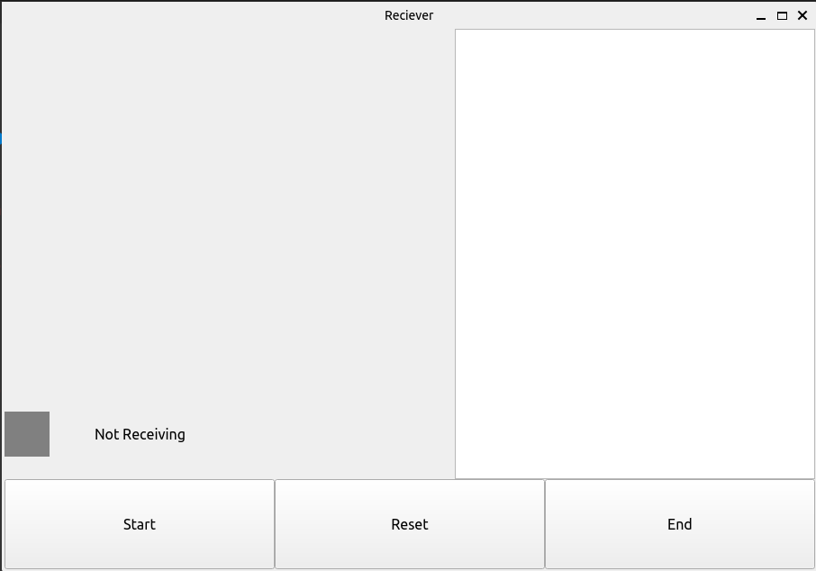

# IOTProject

IOT Project 1. Bluetooth emulation with sound. 2. Distance estimation.

General help `python main.py --help`

1. Bluetooth Emulation

   - Sender

     Run `python main.py -b -s`

     

     Add text in the textbox, click send to send audio signal.

   - Receiver

     Run `python main.py -b -r`

     

     Click on start to begin receiving audio signal, after all audio signal is received a message will pop up showing the time used. Decoded text is shown in upper right text box.

     Click on reset to clear the textbox, end to prematurely finish receive.

2. Distance estimation (No GUI)

   - Sender

     Run `python main.py -d -s --ip [ip string] --port [port int]`

     Sender will attempt to send TCP connection to host [ip] and port [port], after successful connection it will send a short audio signal.

   Click

   - Receiver

     Run `python main.py -d -r --port [port int]`

     Receiver will listen on port [port], after receiving connection, it will start listening to audio signal and estimate distance.

3. Debugging mode

   Add `--debug` argument to plot signal and print debugging information.
